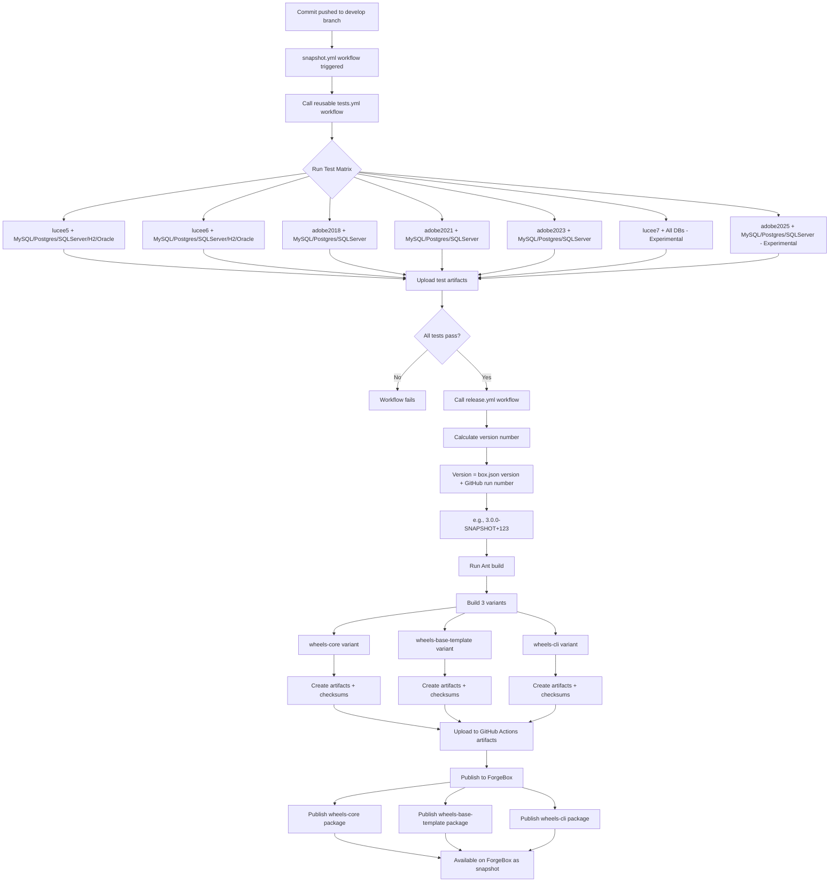

# Wheels Snapshot Publishing Process Flow

## Overview
When a commit is made to the `develop` branch, an automated process runs tests and publishes a snapshot version to ForgeBox.

## Flow Diagram

## Process Details

### 1. Trigger (snapshot.yml)
- **Trigger**: Push to `develop` branch
- **Purpose**: Run tests and create snapshot releases

### 2. Test Phase (tests.yml)
- **Test Matrix**:
  - 5 CF engines (Lucee 5/6/7, Adobe 2018/2021/2023/2025)
  - 5 databases (MySQL, PostgreSQL, SQL Server, H2, Oracle)
  - Some combinations excluded (e.g., Adobe engines don't test with H2/Oracle)
  - Lucee 7 and Adobe 2025 marked as experimental (non-blocking)

### 3. Build Phase (release.yml)
- **Version Calculation**:
  - Base version from box.json (3.0.0-SNAPSHOT)
  - Appends GitHub run number (e.g., +123)
- **Build Process**: Uses Ant (build.xml) to create 3 variants:
  1. **wheels-core**: Core framework files
  2. **wheels-base-template**: Base application template
  3. **wheels-cli**: CommandBox CLI module

### 4. Publishing Phase
- **Artifacts**: Each variant gets:
  - ZIP file
  - MD5 checksum
  - SHA512 checksum
  - Bleeding edge (be) version
- **ForgeBox Publishing**: Uses pixl8/github-action-box-publish
  - Authenticates with wheels-dev user
  - Force publishes to overwrite existing snapshots
  - Each variant published separately

### 5. Key Files
- `.github/workflows/snapshot.yml`: Main workflow for develop branch
- `.github/workflows/tests.yml`: Reusable test workflow
- `.github/workflows/release.yml`: Reusable release/publish workflow
- `build/build.xml`: Ant build configuration
- `box.json`: Package configuration for each variant

### 6. Environment Variables
- `WHEELS_VERSION`: Calculated version with build number
- `BRANCH`: Set to "develop" for snapshots
- `WHEELS_PRERELEASE`: Set to false for snapshots
- `FORGEBOX_API_TOKEN` & `FORGEBOX_PASS`: Authentication secrets

This process ensures that every commit to develop is thoroughly tested across multiple CF engines and databases before being published as a snapshot for community testing.
