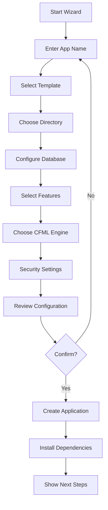

# wheels generate app-wizard
*This command works correctly without options (parameters). Option support is under development and will be **available soon**.*

Interactive wizard for creating a new Wheels application.

## Synopsis

```bash
wheels generate app-wizard [options]
wheels g app-wizard [options]
```

## Description

The `wheels generate app-wizard` command provides an interactive, step-by-step wizard for creating a new Wheels application. It guides you through all configuration options with helpful prompts and explanations, making it ideal for beginners or when you want to explore all available options.

## Options

| Option | Description | Default |
|--------|-------------|---------|
| `--expert` | Show advanced options | `false` |
| `--skip-install` | Skip dependency installation | `false` |
| `--help` | Show help information | |

## Interactive Process

### Step 1: Application Name
```
? What is the name of your application? › myapp
```
- Must be alphanumeric with hyphens/underscores
- Used for directory and configuration names

### Step 2: Template Selection
```
? Which template would you like to use? › 
  ❯ Base - Minimal Wheels application
    Base@BE - Backend-only (no views)
    HelloWorld - Simple example application
    HelloDynamic - Database-driven example
    HelloPages - Static pages example
```

### Step 3: Target Directory
```
? Where should the application be created? › ./myapp
```
- Defaults to `./{app-name}`
- Can specify absolute or relative path

### Step 4: Database Configuration
```
? Would you like to configure a database? (Y/n) › Y
? Database type? › 
  ❯ H2 (Embedded)
    MySQL
    PostgreSQL
    SQL Server
    Custom
```

### Step 5: Additional Features
```
? Select additional features: › 
  ◯ Bootstrap CSS framework
  ◯ jQuery library
  ◯ Sample authentication
  ◯ API documentation
  ◯ Docker configuration
```

### Step 6: CFML Engine
```
? Which CFML engine will you use? › 
  ❯ Lucee 5
    Lucee 6
    Adobe ColdFusion 2018
    Adobe ColdFusion 2021
    Adobe ColdFusion 2023
```

### Step 7: Security Settings
```
? Set reload password (leave blank for 'wheels'): › ****
? Enable CSRF protection? (Y/n) › Y
? Enable secure cookies? (y/N) › N
```

### Step 8: Review & Confirm
```
Application Configuration:
─────────────────────────
Name:       myapp
Template:   Base
Directory:  ./myapp
Database:   H2 (Embedded)
Features:   Bootstrap, jQuery
Engine:     Lucee 5
Reload PWD: ****

? Create application with these settings? (Y/n) › Y
```

## Wizard Flow



## Expert Mode

Enable expert mode for additional options:

```bash
wheels generate app-wizard --expert
```

Additional prompts in expert mode:
- Custom server ports
- JVM settings
- Environment-specific configurations
- Advanced routing options
- Custom plugin repositories
- Build tool integration

## Configuration Profiles

Save and reuse configurations:

### Save Profile
```
? Save this configuration as a profile? (y/N) › Y
? Profile name: › enterprise-api
```

### Use Profile
```bash
wheels generate app-wizard profile=enterprise-api
```

### List Profiles
```bash
wheels generate app-wizard --list-profiles
```

## Feature Descriptions

### Bootstrap CSS
- Includes Bootstrap 5.x
- Responsive grid system
- Pre-styled components
- Example layouts

### jQuery Library
- Latest jQuery version
- AJAX helpers configured
- Example usage in views

### Sample Authentication
- User model with secure passwords
- Login/logout controllers
- Session management
- Protected routes example

### API Documentation
- OpenAPI/Swagger setup
- Auto-generated documentation
- Interactive API explorer

### Docker Configuration
- Multi-stage Dockerfile
- docker-compose.yml
- Development & production configs
- Database containers

## Post-Creation Steps

After successful creation, the wizard displays:

```
✓ Application created successfully!

Next steps:
1. cd myapp
2. box install (or run manually if skipped)
3. box server start
4. Visit http://localhost:3000

Additional commands:
- wheels test          Run tests
- wheels dbmigrate up  Run migrations
- wheels generate      Generate code
- wheels help          Show all commands
```

## Error Handling

The wizard handles common issues:

- **Invalid names**: Suggests valid alternatives
- **Existing directories**: Offers to overwrite or choose new location
- **Missing dependencies**: Provides installation instructions
- **Configuration errors**: Allows editing before creation

## Validation Rules

### Application Name
- Start with letter
- Alphanumeric plus `-` and `_`
- No spaces or special characters
- Not a reserved word

### Directory Path
- Must be writable
- Cannot be system directory
- Warns if not empty

### Passwords
- Minimum 6 characters
- Strength indicator
- Confirmation required

## Customization

### Custom Templates

Add templates to `~/.wheels/templates/`:

```
~/.wheels/templates/
├── my-template/
│   ├── template.json
│   ├── config/
│   ├── controllers/
│   └── views/
```

### Template Configuration

`template.json`:
```json
{
  "name": "My Custom Template",
  "description": "Custom template for specific use case",
  "author": "Your Name",
  "version": "1.0.0",
  "prompts": [
    {
      "name": "apiVersion",
      "message": "API version?",
      "default": "v1"
    }
  ]
}
```

## Integration

### CI/CD Pipeline

Generate with CI configuration:
```bash
wheels generate app-wizard ci=github
```

Includes:
- `.github/workflows/test.yml`
- Build configuration
- Deployment scripts

### IDE Configuration

Generate with IDE files:
```bash
wheels generate app-wizard ide=vscode
```

Includes:
- `.vscode/settings.json`
- `.vscode/launch.json`
- `.editorconfig`

## Best Practices

1. Run wizard in empty directory
2. Choose descriptive application names
3. Configure database early
4. Enable security features for production
5. Save profiles for team consistency
6. Review all settings before confirming

## Common Use Cases

### API-Only Application
- Choose Base@BE template
- Skip Bootstrap/jQuery
- Enable API documentation
- Configure CORS settings

### Traditional Web Application
- Choose Base template
- Include Bootstrap/jQuery
- Add sample authentication
- Configure session management

### Microservice
- Choose Base@BE template
- Configure Docker
- Set specific ports
- Minimal dependencies

## Troubleshooting

### Wizard Freezes
- Check terminal compatibility
- Try `--no-interactive` mode
- Check system resources

### Installation Fails
- Verify internet connection
- Check CommandBox version
- Try `--skip-install` and install manually

### Configuration Issues
- Review generated `.wheels-cli.json`
- Check `server.json` settings
- Verify file permissions

## See Also

- [wheels generate app](app.md) - Non-interactive app generation
- [wheels init](../core/init.md) - Initialize existing directory
- [wheels scaffold](scaffold.md) - Generate CRUD scaffolding